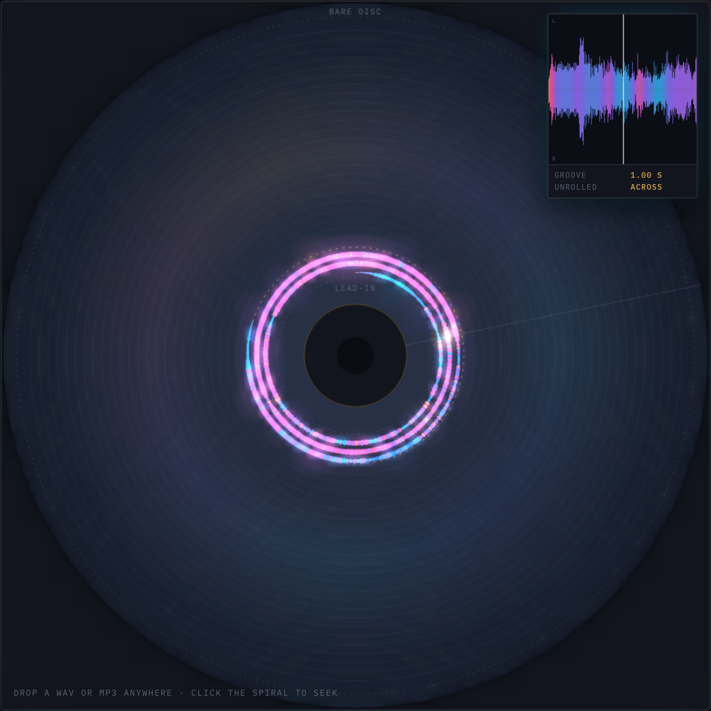
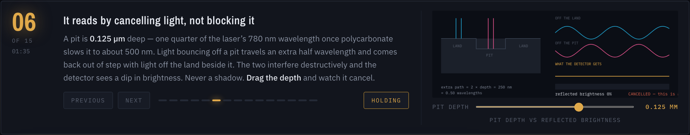
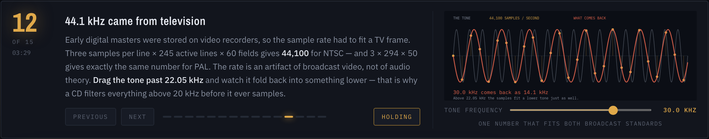
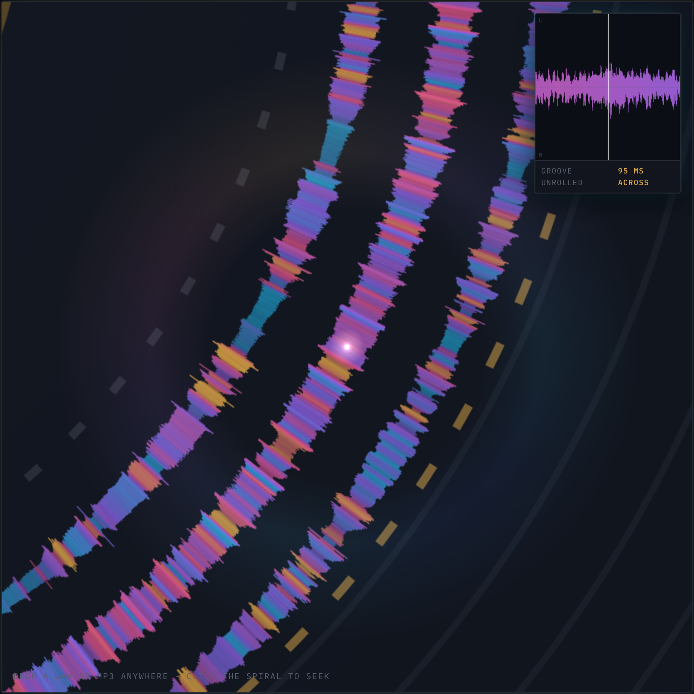
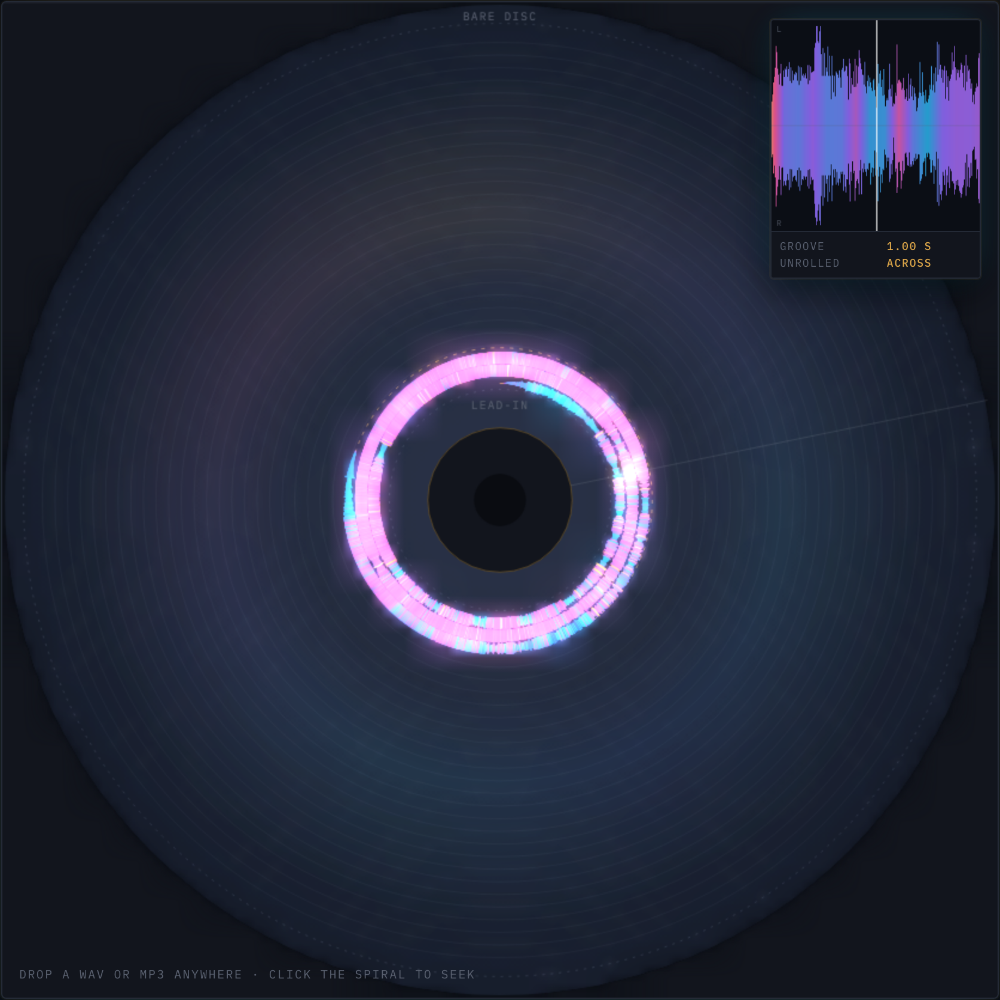

# How Audio CDs Work

**A compact disc explained by writing a real song onto one at true scale, then letting
you fly the read head along it.**

Drop in any WAV or MP3 and it becomes the subject.

**[Open it →](https://keithadler.github.io/how-audio-cds-work/)**



That small glowing coil is an entire song — 4 minutes 46 seconds of it. Everything
outside the dashed line is bare polycarbonate that never gets written to. **One song is
6.4% of a CD.** Most explainers draw the spiral filling the disc; that picture is a lie,
and the truth is more interesting.

---

## What makes it different

Almost every CD diagram on the internet is schematic. This one is measured.

Radius follows the real area rule. At constant linear velocity the groove sweeps equal
area per second, so radius grows with the **square root** of elapsed pit-track length,
not linearly with time:

```
r(t) = sqrt(r0² + v·t·p/π)        r0 = 25 mm, v = 1.2 m/s, p = 1.6 µm
```

Which is why a 4:46 song reaches 28.28 mm and uses **10% of the radial span** while
consuming only **6.4% of the playing time** — inner turns are shorter, so early music
spends radius faster. That asymmetry is real, it falls straight out of the geometry, and
you can watch it happen.

Every number in the interface is derived, never decorative:

| Readout | Where it comes from |
| --- | --- |
| Spin, 458 → 405 rpm | `v / 2πr`, recomputed every frame |
| Radius, 25.00 → 28.28 mm | the area rule above |
| Revolutions, 2,051 of 20,500 | `(r − r0) / pitch` |
| Pit track, 343 m of 5,332 m | `v · t`, against `π(r1² − r0²)/p` |
| Position, MM:SS:FF | real Red Book timecode, 75 sectors per second |

---

## Fifteen notes that advance with the read head

Five of them you can operate:

| Figure | Drag it and |
| --- | --- |
| **Pit depth** | watch the reflection cancel at a quarter wavelength — brightness hits 0% at 0.125 µm |
| **Beam focus** | see how little of an out-of-focus beam a surface scratch actually costs |
| **Constant linear velocity** | move the head and watch rpm fall 458 → 198 while pit speed never budges |
| **Sampling** | push a tone past 22.05 kHz and watch it fold back to a lower frequency |
| **CIRC** | extend the damage until error correction gives up, at 2.4 mm and again at 8 mm |



A CD does not read shadows. A pit is 0.125 µm deep — a quarter of the laser's 780 nm
wavelength once polycarbonate slows it to about 500 nm — so light returning from a pit
is half a wave out of step with light off the land beside it, and the two destructively
interfere. Drag the depth and the summed wave flattens to nothing.



44.1 kHz is not an audio number, it is a television number. Early digital masters lived
on video recorders, so the rate had to fit a frame: 3 samples × 245 active lines × 60
fields for NTSC, and 3 × 294 × 50 for PAL, both landing on exactly 44,100.

Eight retrieval questions close it out, answers hidden until you commit to one.

---

## Inside the groove



Zoom past 1× and the page stops scaling a bitmap and redraws the visible slice as live
vectors, so magnification stays sharp. Ribbon thickness is peak level. Colour is the
spectral centre of that slice — bass runs blue, cymbals and sibilance run gold.

**One honest caveat**, also stated in the app: left is drawn toward the hub and right
toward the rim. That is a reading aid, not physics. A real disc carries one pit stream
with the channels multiplexed inside it — six left samples and six right per frame,
alternating — which CIRC then deliberately scatters across ~108 frames.

---

## The loudness war, as a physical object



Toggle between three masters and the groove changes shape, because ribbon thickness is
absolute level against one shared reference.

| | Peak | Gated RMS | Crest |
| --- | --- | --- | --- |
| 1990 (simulated) | −1.4 | −19.1 | **17.6 dB** |
| As delivered | −5.1 | −17.8 | **12.8 dB** |
| 2026 loud (simulated) | −0.3 | −9.4 | **9.1 dB** |

The loudness war is not about making quiet parts quieter. It is about **flattening
transients** so the average can be lifted underneath them — peak stays pinned at the
ceiling while crest factor collapses. So the 1990 simulation runs a 1 ms peak follower
against a 200 ms average and restores whatever pokes above local level; the 2026 one
drives a 0.5 ms brickwall at −0.3 dBFS chasing a −9 dBFS average.

Neither alternate is archival. Limiting cannot be perfectly undone. They show what each
era's *dynamics* looked like, not what an engineer would have printed.

---

## Running it

No build step, no dependencies, no network calls, no telemetry.

```bash
git clone https://github.com/keithadler/how-audio-cds-work.git
cd how-audio-cds-work
python3 -m http.server 8931
```

Then open <http://localhost:8931>.

To produce a single portable file with the audio inlined — one 7.4 MB HTML you can mail
to someone:

```bash
python3 build.py
```

**Use your own music.** Drag any WAV, MP3, FLAC, AAC or Ogg onto the page, or press
*Open file*. Everything re-derives from your audio: geometry, index points, loudness,
all three masters. Nothing is uploaded — the file never leaves your machine.

---

## How it works

`AudioContext.decodeAudioData()` handles every format above natively, so there is no
WASM decoder and no library. Decoding is pinned to an **`OfflineAudioContext` at
44,100 Hz** rather than the system output rate, because a CD is 44.1 kHz by definition —
which is also exactly the resampling a 48 kHz master gets on its way to a disc. Without
this the page would silently analyse at 48 kHz on most Macs while teaching 44.1.

Analysis is an 18,000-bucket peak and RMS envelope, plus a 4,200-frame spectrogram from
a hand-rolled radix-2 FFT with a Hann window, used for the spectral-centroid colouring.
Loudness is gated in 400 ms blocks with an absolute −70 dBFS gate and a −10 dB relative
gate, reported honestly as gated RMS rather than dressed up as LUFS, since there is no
K-weighting.

Rendering is 2D canvas throughout: a static disc layer with a two-tap downscale bloom,
switching to live vector redraw of the visible bucket range once you zoom in. About
2,400 lines in one file.

Needs a modern browser with Web Audio. Tested in Chromium 148.

---

## Credits and licensing

Two licenses, because there are two different things in here.

**The software** is MIT. See [`LICENSE`](LICENSE).

**The music** is [CC BY-NC 4.0](https://creativecommons.org/licenses/by-nc/4.0/).
See [`LICENSE-MUSIC.md`](LICENSE-MUSIC.md).

> *"The One Who Let You Go"*, written by Keith Adler (BMI, IPI 551038589), performed by
> Marty Gregg, from *The Aura Principle Soundtrack*. © 2026 Keith Adler.

Share it, remix it, put it under your video — free, with credit, for anything
non-commercial. Commercial rights are retained in full: for advertising, film, TV, games,
monetized releases or sync, contact Keith Adler for a separate license.
